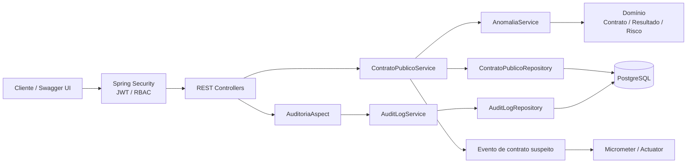

# AuditaGov


MVP de transparência e auditoria de contratos públicos. O AuditaGov recebe dados contratuais, registra trilha de auditoria e aplica regras configuráveis de triagem de risco. Os alertas indicam itens para análise humana; não constituem prova de fraude nem substituem avaliação jurídica ou os limites legais aplicáveis.

## Arquitetura

O núcleo de domínio mantém contrato, nível de risco e resultado analítico; serviços coordenam ingestão, análise e auditoria; adaptadores Spring MVC, JPA, Spring Security e Actuator expõem as portas externas.



### Componentes

- **API e aplicação:** Spring Boot 3, Java 21, validação Jakarta, paginação e DTOs.
- **Domínio e persistência:** entidades JPA e repositórios Spring Data; PostgreSQL no Compose e H2 disponível para uso local.
- **Segurança:** endpoints de contratos exigem autenticação e perfis. O login JWT de demonstração existe apenas no perfil `demo`, com credenciais e chave fornecidas pelo ambiente.
- **Auditoria:** operações anotadas registram usuário, ação, IP e detalhes em `audit_logs`; a entidade não oferece operações de edição ou remoção na aplicação.
- **Observabilidade:** Actuator expõe health e métricas, incluindo `auditagov.contratos.suspeitos`.

## Regras do motor de anomalias

As regras são ajustáveis pelas propriedades `audita.anomalias.*`:

| Regra | Resultado inicial |
|---|---|
| Contrato ≥ 2,0× média da categoria | Crítico |
| Contrato > 1,5× média da categoria | Alto |
| Contrato > orçamento × 1,2 | Alto |
| Contrato > orçamento × 1,1 | Médio |
| Dispensa, inexigibilidade ou contratação direta ≥ R$ 100.000 | Crítico |
| Contratação direta ≥ R$ 50.000 | Alto |

A comparação histórica usa a média dos contratos persistidos anteriormente na mesma categoria. Os limites financeiros acima são parâmetros demonstrativos, não valores legais. Ajuste-os à política da organização e à legislação vigente antes de qualquer uso operacional.

## Painel executivo

A página inicial (`/`) serve o dashboard responsivo com tema claro/escuro, indicadores de contratos e valores, contratos paginados, gráfico de anomalias por categoria e formulário de ingestão. Entre com o perfil `auditor` ou `admin` para consultar os indicadores; o perfil `ingestor` pode cadastrar contratos. O painel persiste o JWT no `localStorage` deste navegador e o remove ao sair ou quando a API rejeita a sessão. A rota `/api/contratos/resumo` agrega os valores e riscos diretamente na base de dados.

## Executar com Docker Compose

Requer Docker Engine e Docker Compose. Defina senhas locais fortes e uma chave HMAC de pelo menos 32 caracteres. No PowerShell:

```powershell
$env:POSTGRES_PASSWORD = Read-Host "Senha local do PostgreSQL"
$env:AUDITA_DEMO_JWT_SECRET = Read-Host "Chave HMAC aleatória (mínimo 32 caracteres)"
$env:AUDITA_DEMO_PASSWORDS_INGESTOR = Read-Host "Senha para ingestor"
$env:AUDITA_DEMO_PASSWORDS_AUDITOR = Read-Host "Senha para auditor"
$env:AUDITA_DEMO_PASSWORDS_ADMIN = Read-Host "Senha para admin"
docker compose up --build
```

No Bash, exporte as mesmas variáveis antes de executar `docker compose up --build`. Não use senhas de produção neste ambiente de demonstração. Para encerrar, execute `docker compose down`; acrescente `-v` somente se quiser remover também os dados persistidos do PostgreSQL.
Se a porta local `8080` já estiver ocupada, defina `AUDITAGOV_PORT` para outra porta antes de iniciar.

Após a inicialização:

- Swagger UI: <http://localhost:8080/swagger-ui/index.html>
- OpenAPI: <http://localhost:8080/v3/api-docs>
- Health: <http://localhost:8080/actuator/health>
- Métricas: <http://localhost:8080/actuator/metrics>
- Login demo: `POST /api/v1/auth/login` com `username` (`ingestor`, `auditor` ou `admin`) e a senha correspondente configurada acima.

Os tokens emitidos duram 15 minutos. O perfil `demo` usa usuários em memória e assinatura HMAC local para fins de demonstração; substitua-o por um provedor de identidade e gestão de chaves apropriados antes de disponibilizar o serviço publicamente. As rotas de métricas são públicas por requisito de demonstração; restrinja-as em ambientes reais.

### Exemplos cURL

Autentique-se com o usuário ingestor para receber um JWT:

```bash
TOKEN=$(curl --fail-with-body --silent --show-error \
  -H 'Content-Type: application/json' \
  -d "{\"username\":\"ingestor\",\"password\":\"${AUDITA_DEMO_PASSWORDS_INGESTOR}\"}" \
  http://localhost:8080/api/v1/auth/login | jq -r '.accessToken')
```

Envie um contrato. O token é obrigatório e o perfil `INGESTOR` pode criar contratos:

```bash
curl --fail-with-body --silent --show-error \
  -H "Authorization: Bearer ${TOKEN}" \
  -H 'Content-Type: application/json' \
  -d '{
    "numeroProcesso": "PROC-2025-001",
    "numeroContrato": "CONT-2025-001",
    "objeto": "Serviços de tecnologia",
    "orgaoContratante": "Órgão de demonstração",
    "cnpjContratado": "00000000000000",
    "nomeContratado": "Fornecedor de demonstração",
    "categoria": "TI",
    "valorOrcamento": 100000,
    "valorContratado": 120000,
    "tipoContratacao": "DISPENSA",
    "dataAssinatura": "2025-01-01",
    "inicioVigencia": "2025-01-01",
    "fimVigencia": "2025-12-31"
  }' \
  http://localhost:8080/api/contratos
```

Este exemplo deve classificar o contrato como `CRITICO` devido ao limite demonstrativo de contratação direta. Verifique a métrica do contador (inclui a tag `nivel_risco`):

```bash
curl --fail-with-body --silent --show-error \
  'http://localhost:8080/actuator/metrics/auditagov.contratos.suspeitos?tag=nivel_risco:CRITICO'
```

## Executar testes

A suíte requer Java 21, Maven e Docker em execução para o teste PostgreSQL com Testcontainers:

```bash
mvn clean verify
```

O CI executa o mesmo comando em pull requests e pushes para `main`. Os testes unitários usam JUnit 5/Mockito; os testes de integração iniciam PostgreSQL com Testcontainers.
